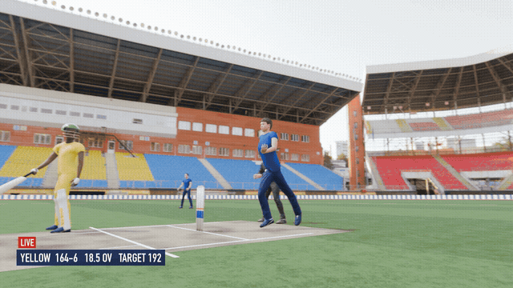
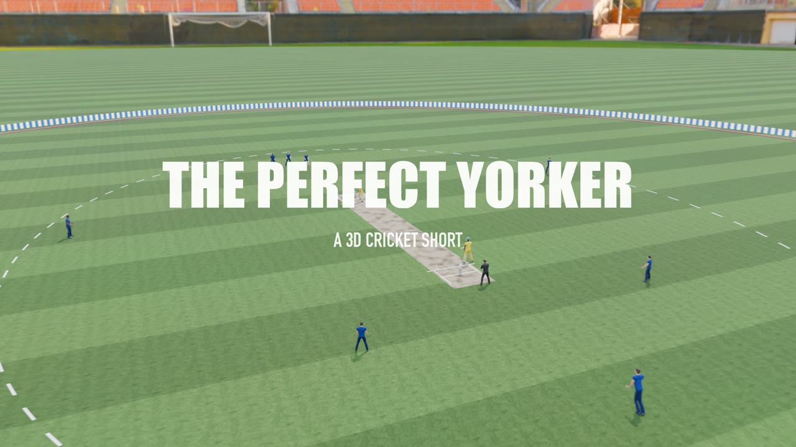
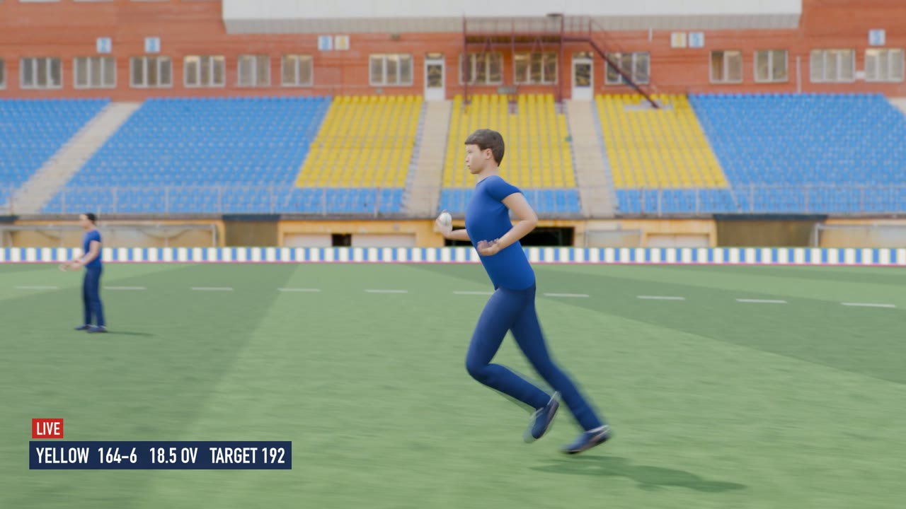
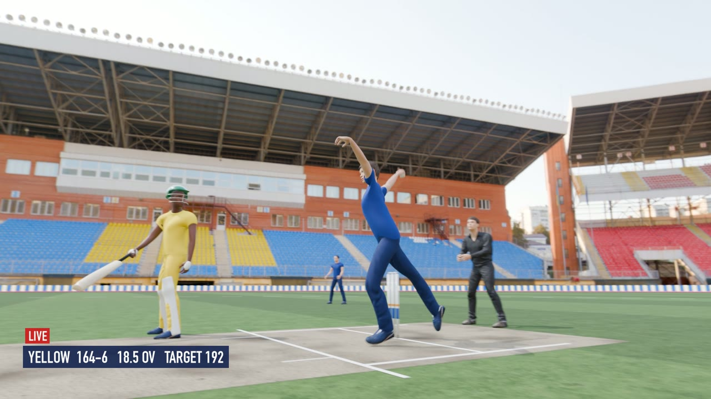
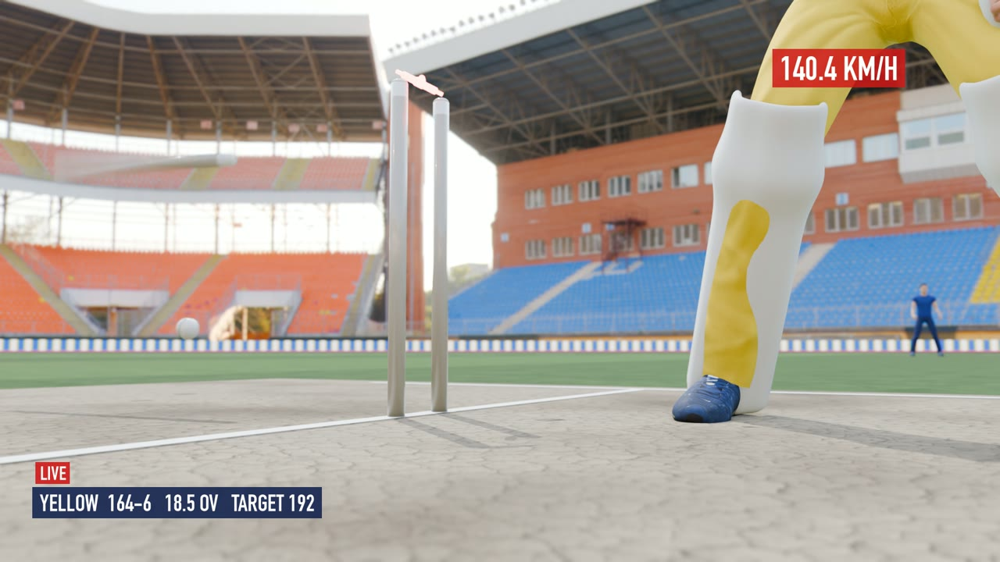
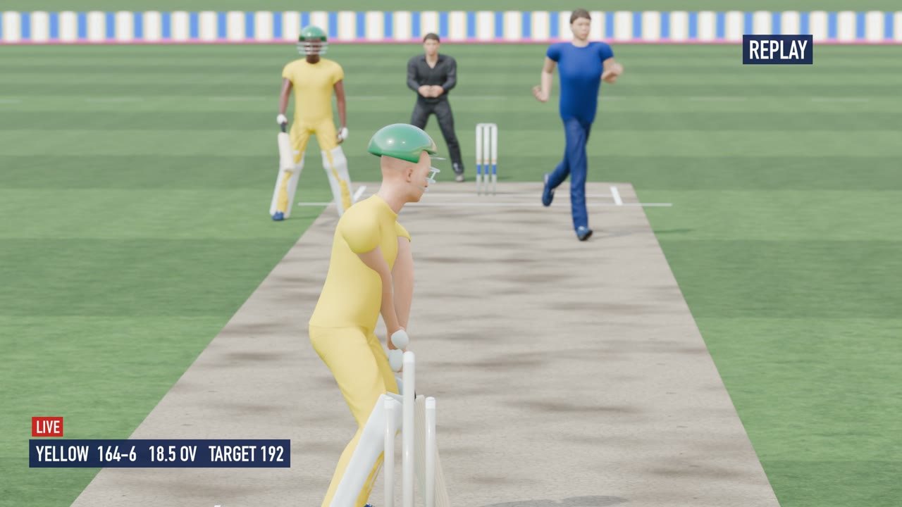
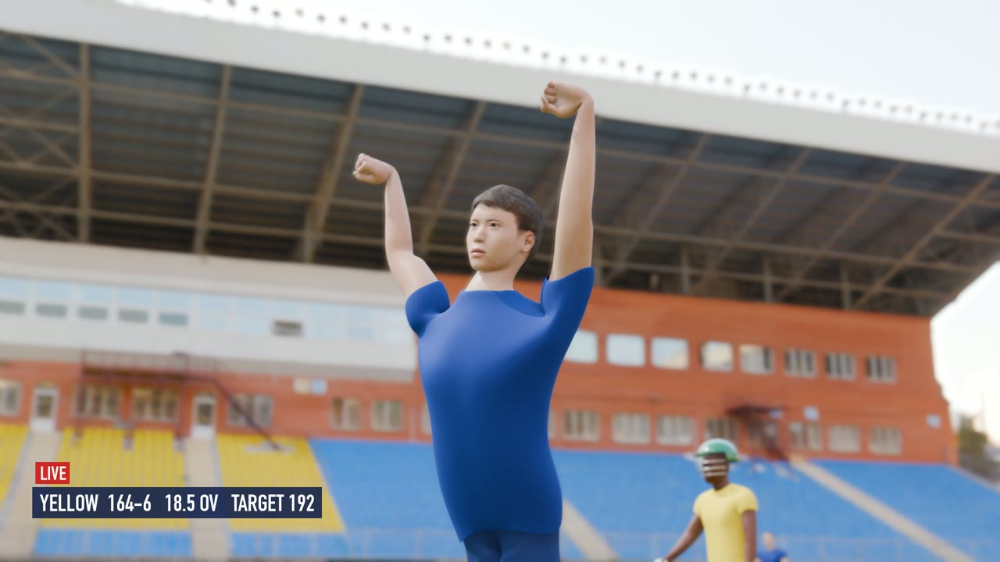

# The Perfect Yorker 🏏: a 3D cricket short directed through an LLM

> **An experiment:** can a modern LLM take a one-line idea and turn it into a realistic 3D animated film, using only free tools and free assets?

I wanted to try 3D modelling and animation without knowing Blender. I described the idea in plain English to **Claude Opus 5.5** (running in [Claude Code](https://claude.com/claude-code)). It wrote the script, searched for free 3D assets, and then built, animated, rendered and edited the whole 30-second film **entirely in Python**. I never touched the Blender UI. My job was directing: giving the idea, adding constraints ("use only free things", "use different camera angles") and pointing out what looked wrong.

<p align="center">
  
</p>

**▶ Full video (1080p, 30 s, with sound):** [`media/perfect_yorker_1080p.mp4`](media/perfect_yorker_1080p.mp4)

---

## The story

A fast bowler runs in and sends down a 140 km/h yorker. The batsman's bat comes down a fraction too late, and the ball sneaks underneath and shatters the stumps.

| # | Shot | Camera |
|---|------|--------|
| 1 | Establishing: stadium, title card | High crane sweeping down |
| 2 | Bowler at the top of his mark, polishing the ball | Over-the-shoulder, 38 mm |
| 3 | Batsman takes guard, bowler starts his run | Over the batsman's shoulder, rack focus |
| 4 | The run-up | Side-on tracking dolly |
| 5 | Classic TV angle | 200 mm long lens from behind the stumps |
| 6 | Delivery stride | Low angle, **0.3× slow motion** |
| 7 | The yorker swings in | Chase-cam behind the ball, 0.25× |
| 8 | Ball beats the bat, stumps explode, LED bails flash | Ground-level stump cam, **0.1× slow motion** |
| 9 | Replay | End-on from behind the keeper, 0.5× |
| 10 | Celebration → "CLEAN BOWLED!" | Low hero angle → aerial pull-out |

| | | |
|---|---|---|
|  |  |  |
|  |  |  |

---

## How it was made

Everything is generated by code. There are no AI-generated images or video. The frames are real renders of a 3D scene:

```
idea (plain English)
   │  Claude Opus 5.5 writes the shot list, finds free assets, writes the Python
   ▼
Blender 5.2 (headless, driven by bpy)
   ├─ MakeHuman characters (MPFB)  ── rigged humans, recoloured into team kits
   ├─ CMU motion capture           ── real running data retargeted onto the bowler
   ├─ procedural animation         ── bowling action, batsman, keeper, fielders, umpire
   ├─ Python-modelled props        ── stumps, LED bails, ball + seam, bat, pads, helmets
   ├─ Bullet rigid-body physics    ── the ball really knocks the stumps over
   └─ EEVEE renderer               ── HDRI lighting, depth of field, motion blur
   ▼
721 PNG frames ──► ffmpeg (broadcast graphics) + numpy-synthesised soundtrack ──► MP4
```

### Some things the LLM had to figure out along the way
- **Retargeting mocap:** the CMU BVH skeleton and the MakeHuman rig have different rest poses (T-pose vs A-pose). It wrote a world-space rotation-delta retargeter, spotted that frame 1 of every CMU file is a T-pose calibration frame, and skipped it.
- **Looping a run:** the mocap clips are about 1.5 s long, so it searched for the best loop point and a phase-matched transition between two clips to build a 4-second run-up. It then placed the run so the front foot lands just behind the popping crease.
- **A bowling action from scratch:** no free bowling mocap exists, so the delivery is hand-authored on top of the running legs: side-on gather, arm windmill, release just past vertical, follow-through.
- **Slow motion that works with physics:** the world timeline runs at 240 fps. Each shot maps output frames to world time at its own speed, and the Bullet simulation is baked to keyframes so sub-frame slow motion stays smooth.
- **Hands that look like hands:** the first version used a simplified CMU-style rig with one finger bone, so hands stayed flat and splayed, and the ball "floated" on an open palm. After my feedback it tested finger curling in close-up renders, found that the simple rig's weights couldn't make a fist, and switched every character to MakeHuman's full rig (3 bones per finger). It added an alias layer so the mocap and animation code kept working, plus named hand shapes: a seam **ball grip** until release, **fists** in the celebrations, and a **bat grip** for the batsmen.
- **Believable heads:** the batsman originally snapped his neck about 150° to look back at his broken stumps and his head flopped forward. Head-turns are now solved as separate yaw and pitch with human neck limits, big turns are shared with the spine, and the batsman turns his whole body (bat included) to look back.
- **Checking its own work:** after each change it rendered contact sheets and looked at them, then fixed what it saw: missing helmets (a parenting bug), olive-coloured grass, fake-looking sight screens, stumps overlapping in the stump cam, and a bowler's wrist bent the wrong way.

### What I (the human) actually said
The whole film came from a handful of messages, roughly:
1. *"Decide a short 30 sec video script about cricket: a bowler running and bowling a yorker, the stumps are broken. Create this with 3D modelling, search for free 3D models, make it look realistic, use Python."*
2. *"Use only free things."*
3. *"Use different camera angles."*
4. *"The bowler's hand is not looking good, it's in a different direction."*
5. *"The bowler's hand is still very terrible and he's not gripping the ball correctly; the celebration hands are terrible too, and the batsman's head is falling down when the stumps are bowled."*

---

## Free assets & credits

| What | Source | License |
|------|--------|---------|
| 3D software | [Blender 5.2](https://www.blender.org) | GPL |
| Human characters | [MPFB 2 / MakeHuman](http://static.makehumancommunity.org/mpfb.html) + system assets | GPL add-on, CC0 assets |
| Running motion | [CMU Graphics Lab Motion Capture Database](http://mocap.cs.cmu.edu/), BVH via [cgspeed](https://sites.google.com/a/cgspeed.com/cgspeed/motion-capture/the-motionbuilder-friendly-bvh-conversion-release-of-cmus-motion-capture-database) / [una-dinosauria/cmu-mocap](https://github.com/una-dinosauria/cmu-mocap) | Free for any use |
| Stadium HDRI (`stadium_01`), grass & pitch textures | [Poly Haven](https://polyhaven.com) | CC0 |
| Stumps, bails, ball, bat, pads, helmets, ground | Modelled procedurally in `scripts/props.py` (regulation dimensions) | this repo |
| Soundtrack | Synthesised with NumPy in `scripts/audio.py` | this repo |
| Encoding & titles | [ffmpeg](https://ffmpeg.org) | LGPL/GPL |

The downloaded assets are **not** committed. `setup_assets.sh` fetches them.

---

## Reproduce it

Requirements: macOS/Linux, [Blender 5.2+](https://www.blender.org/download/), `ffmpeg`, `curl`, `unzip`.

```bash
./setup_assets.sh                                   # download free assets, install MPFB

BLENDER=/Applications/Blender.app/Contents/MacOS/Blender
$BLENDER -b --python scripts/build.py               # build scene -> render/cricket.blend + shots.json

$BLENDER -b render/cricket.blend --python scripts/render.py -- --stills               # quick check: 2 stills per shot
$BLENDER -b render/cricket.blend --python scripts/render.py -- --samples 64           # all frames, 1920x1080
#   (fast preview: add  --res 640x360 --samples 12 --out preview)

"$(dirname $BLENDER)/../Resources/5.2/python/bin/python3.13" scripts/audio.py   # soundtrack (needs numpy; Blender's Python has it)
python3 scripts/assemble.py render/frames cricket_yorker.mp4                    # graphics + audio -> MP4
```

The full render took about 50 minutes on an Apple M4 Pro (EEVEE, about 4 s per frame).

### Code map
| File | Purpose |
|------|---------|
| `scripts/build.py` | Assembles the scene: world, characters, animation, ball flight, physics, cameras and shot list |
| `scripts/props.py` | Procedural models & materials: pitch, outfield, boundary, stumps, LED bails, ball, bat, pads, helmet |
| `scripts/characters.py` | Builds MakeHuman characters via MPFB, recolours kits |
| `scripts/posing.py` | Pose layer system: BVH → MakeHuman rig retargeting (via a CMU-name alias layer), FK, keyframing, hand shapes |
| `scripts/anim.py` | Run-up loop synthesis, bowling action, celebration, stances |
| `scripts/render.py` | Renders the shot list (per-shot speed and motion blur) |
| `scripts/audio.py` | Synthesised crowd, heartbeat, whoosh, stumps crash, roar |
| `scripts/assemble.py` | ffmpeg encode with broadcast-style overlays |
| `scripts/dev/` | Probes and test scripts from the development process |

---

## Honest limitations
- Faces look computer-generated in close-ups. MakeHuman characters work best at mid-to-long distance. Hands use preset finger shapes (grip, fist, relaxed) rather than per-finger animation.
- The bowling action and batsman are procedural keyframes, not motion capture, so they're convincing at speed but less so frame by frame.
- The stadium is a 360° photo (HDRI), so there's no parallax in the stands and the crowd is empty.

## License
Code in this repository is released under the [MIT License](LICENSE). Third-party assets keep their own licenses (see above).
